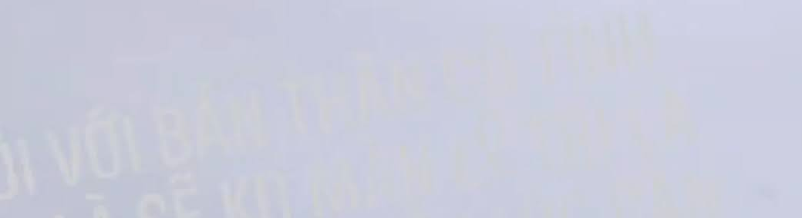

# PHOTO ANALYSIS

This is my 3 hours project. 

The reason for this project is from the girl that I really care about, she wrote something that was difficult to read. And I decided to write this.

## Demo

This is the image:


This is the result:


## User manual

### 0. Environment

Python3.7

### 1. Install python requirement

```basg
pip install -r requirement.txt
```

### 2. Run

- Firstly, you need to push your image to this folder.

- Second, you need to open file [image_analysis.py](./image_analysis.py). And update the `image_path` variable (and the `image_name` variable if you like).

- Third, update 2 paramenters:
    - `acceptable_color_error`: This is the acceptable color error from the origin color that you choose.
    - `acceptable_near_error`: This is the acceptable color error for nearly_color_search algorithm.

- Run the code

```bash
python image_analysis.py 
```

- Press:
    - `double left click` to locate the target color.
    - `a` to print the current cursor position to the terminal.
    - `s` to locate pixels of the same color using my algorithm and color them according to `destination_color`.
    - `esc` to stop

- Stop and get back to the third step, and run it again!
